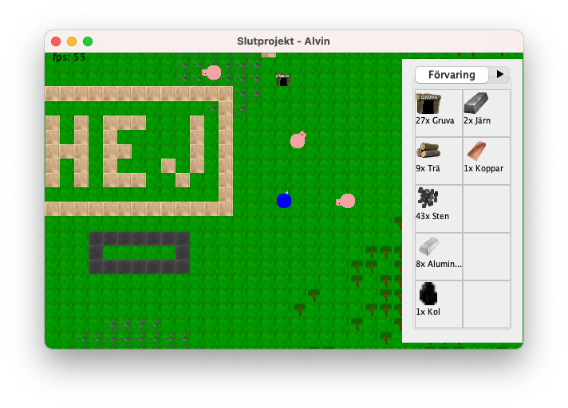
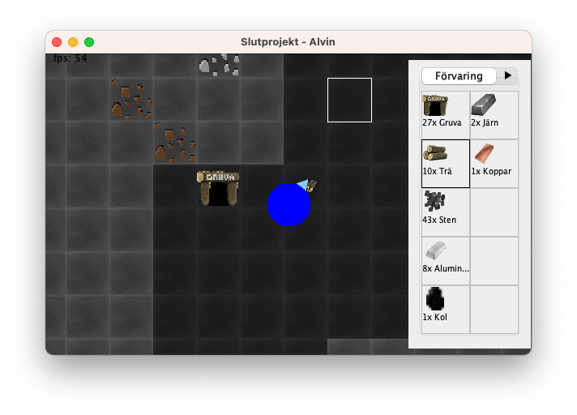
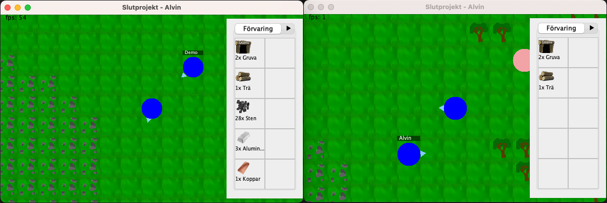

Detta är ett Slutprojekt i Programmering 2 (PRRPRR02).

## Hur man spelar

Man rör sig med WASD eller piltangenterna. Använd musen för att markera tiles. Tilen
får inte vara för långt bort från dig men heller inte för nära.

Vänsterklicka eller tryck ned `b` för att hugga tiles.

Markera det föremål du vill placera på höger sida genom att trycka på det.
Högerklicka sedan eller tryck ned `p` för att placera tiles.

Escape för att pausa, då kan du också återgå till startmenyn.

## Hur man kör projektet

Projektet är byggt med Maven för att underlätta produktionen av två JAR-filer,
en för servern och en för klienten.

För att köra projektet, öppna det i en utveckligsmiljö som IntelliJ och
kör projektet. Öppna klassen `alvin.slutprojekt.client.ClientMain` och kör
`Run File` för att köra spelet.

Alternativt öppna kommandotolken (cmd) och kör `java -jar target/slutprojekt-1.0-client.jar`.

För att testa att spela online finns en demo server som ~~kör hela tiden~~ är en server.
Då kan flera personer lätt ansluta till den och testa projektet. Öppna spelet och
tryck `Spela Online`, sedan hitta `Demo Server` och tryck `Anslut`.

För att istället starta en egen server, öppna filen `alvin.slutprojekt.server.ServerMain`
och kör `Run File`. Du måste sedan starta en klient också. Tryck `Spela Online` och
anslut till `localhost:4137` (den andra servern på listan).